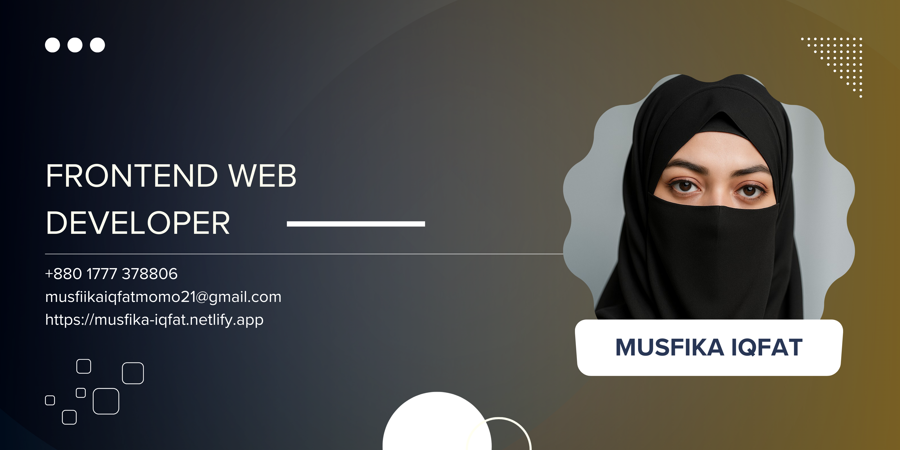

<div align="center">
  
  
  <!-- Animated typing effect -->
  
</div>

<div align="center">
  
  <!-- Animated wave separator -->
  
  
</div>

---

<div align="center">


[](https://github.com/musfika21?tab=followers)
[](https://github.com/musfika21)

</div>

##  About Me


```typescript
interface Developer {
  name: string;
  role: string;
  location: string;
  skills: string[];
  currentFocus: string[];
  passions: string[];
  contact: {
    email: string;
    linkedin: string;
    whatsapp: string;
  };
}

const musfika: Developer = {
  name: "Musfika Iqfat",
  role: "Junior Frontend Developer",
  location: "Dhaka, Bangladesh 🇧🇩",
  skills: ["React.js", "Next.js", "JavaScript", "TypeScript", "Node.js"],
  currentFocus: ["Advanced React Patterns", "Full-Stack Development"],
  passions: ["Clean Code", "User Experience", "Problem Solving"],
  contact: {
    email: "musfikaiqfatmomo21@gmail.com",
    linkedin: "linkedin.com/in/musfika-iqfat21",
    whatsapp: "+8801777378806"
  }
};
```

<br>

🎯 **Mission:** Creating pixel-perfect, responsive web applications that users love  
⚡ **Superpower:** Turning complex ideas into beautiful, functional interfaces  
🌟 **Goal:** Becoming a full-stack wizard while maintaining frontend excellence  
🚀 **Status:** Actively seeking opportunities to make an impact  
📧 **Let's Connect:** [musfikaiqfatmomo21@gmail.com](mailto:musfikaiqfatmomo21@gmail.com) | [LinkedIn](https://linkedin.com/in/musfika-iqfat21) | [WhatsApp](https://wa.me/+8801777378806)  

---

## 🛠️ Tech Arsenal

<div align="center">

### 🎨 Frontend Mastery
<p>
  
</p>

### ⚙️ Backend & Database
<p>
  
</p>

### 🔧 Tools & Platforms  
<p>
  
</p>

### 📊 Currently Learning
<p>
  
</p>

</div>

---

## 📈 GitHub Analytics

<div align="center">
  
  <!-- GitHub streak stats with custom theme -->
  
  
  
</div>

<div align="center">
  
  <!-- Activity graph -->
  
  
</div>

<div align="center">
  
  <!-- Languages and productivity -->
  
  
  
</div>

---

## 🚀 Featured Projects

<div align="center">

<!-- Project cards with custom styling -->
<table>
<tr>
<td width="50%">
<h3 align="center">🌟 Project Alpha</h3>
<div align="center">  
<a href="https://github.com/musfika21/project-alpha" target="_blank">

</a>
</div>
</td>
<td width="50%">
<h3 align="center">🔥 Project Beta</h3>
<div align="center">
<a href="https://github.com/musfika21/project-beta" target="_blank">

</a>
</div>
</td>
</tr>
</table>

</div>

---

## 💬 Let's Connect & Build Something Amazing!

<div align="center">

<a href="mailto:musfikaiqfatmomo21@gmail.com">
  
</a>
<a href="https://linkedin.com/in/musfika-iqfat21">
  
</a>
<a href="https://facebook.com/mumsfikaiqfatmomo21">
  
</a>
<a href="https://wa.me/+8801777378806">
  
</a>

</div>

---

<div align="center">

### 💡 Random Dev Quote


</div>

---

<div align="center">
  
  <!-- Animated footer -->
  
  
  <br>
  
  **✨ "Code is like humor. When you have to explain it, it's bad." - Cory House ✨**
  
  
  
</div>


<!-- Hidden easter egg for curious developers -->

🎉 Congratulations! You found the easter egg! 
If you're reading this, you're probably a developer who likes to peek behind the curtain.
Feel free to reach out - I'd love to connect with fellow curious minds!

